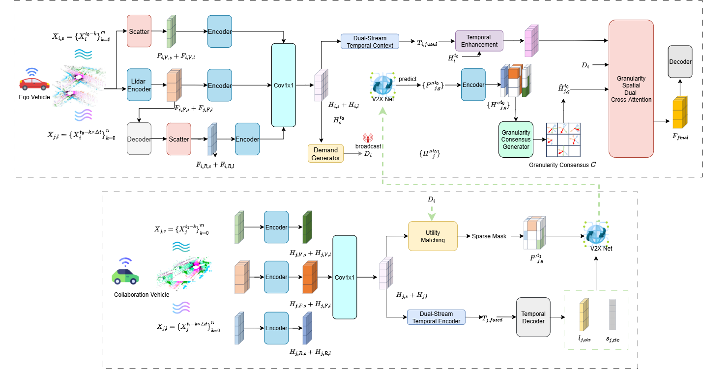

# ChrousNet




> [**ChrousNet*]     
>  Yu Senze <br>


## Abstract

Multi-agent collaborative perception has recently received widespread attention as an emerging application in driving scenarios. Despite the advancements in previous efforts, challenges remain due to various dilemmas in the perception procedure, including communication redundancy, transmission delay, and collaboration heterogeneity. To tackle these issues, we propose *How2comm*, a collaborative perception framework that seeks a trade-off between perception performance and communication bandwidth. Our novelties lie in three aspects. First, we devise a mutual information-aware communication mechanism to maximally sustain the informative features shared by collaborators. The spatial-channel filtering is adopted to perform effective feature sparsification for efficient communication. Second, we present a flow-guided delay compensation strategy to predict future characteristics from collaborators and eliminate feature misalignment due to temporal asynchrony. Ultimately, a pragmatic collaboration transformer is introduced to integrate holistic spatial semantics and temporal context clues among agents.
Our framework is thoroughly evaluated on several LiDAR-based collaborative detection datasets in real-world and simulated scenarios. Comprehensive experiments demonstrate the superiority of How2comm and the effectiveness of all its vital components.


## Installation
Please refer to [OpenCOOD](https://opencood.readthedocs.io/en/latest/md_files/installation.html) and [centerformer](https://github.com/TuSimple/centerformer/blob/master/docs/INSTALL.md) for more installation details.

Here we install the environment based on the OpenCOOD and centerformer repos.

```bash
# Clone the OpenCOOD repo
git clone https://github.com/DerrickXuNu/OpenCOOD.git
cd OpenCOOD

# Create a conda environment
conda env create -f environment.yml
conda activate opencood

# install pytorch
conda install -y pytorch torchvision cudatoolkit=11.3 -c pytorch

# install spconv 
pip install spconv-cu113

# install basic library of deformable attention
git clone https://github.com/TuSimple/centerformer.git
cd centerformer

# install requirements
pip install -r requirements.txt
sh setup.sh

# clone our repo
https://github.com/ydk122024/How2comm.git

# install v2xvit into the conda environment
python setup.py develop
python v2xvit/utils/setup.py build_ext --inplace
```

## Data
Please download the [V2XSet](https://drive.google.com/drive/folders/1r5sPiBEvo8Xby-nMaWUTnJIPK6WhY1B6) and [OPV2V](https://drive.google.com/drive/folders/1dkDeHlwOVbmgXcDazZvO6TFEZ6V_7WUu) datasets. The dataset folder should be structured as follows:
```sh
v2xset # the downloaded v2xset data
  ── train
  ── validate
  ── test
opv2v # the downloaded opv2v data
  ── train
  ── validate
  ── test
```

## Getting Started
### Test with pretrained model
We provide our pretrained models on V2XSet and OPV2V datasets. The download URLs are as follows:

* Baidu Disk URL is [here](https://pan.baidu.com/share/init?surl=oTepWy7q0U_x1jXNThbyMw&pwd=vaz2).


* Google Drive URL is [here](https://drive.google.com/drive/folders/1xuUAJ82BgCP4EERW6S98NjWTzF8Hqrib).


To test the provided pretrained models of How2comm, please download the model file and put it under v2xvit/logs/how2comm. The `validate_path` in the corresponding `config.yaml` file should be changed as `v2xset/test` or `opv2v/test`. 

Run the following command to conduct test:
```sh
python v2xvit/tools/inference.py --model_dir ${CONFIG_DIR} --eval_epoch ${EVAL_EPOCH}
```
The explanation of the optional arguments are as follows:
- `model_dir`: the path to your saved model.
- `eval_epoch`: the evaluated epoch number.

You can use the following commands to test the provided pretrained models:
```sh
V2XSet dataset: python v2xvit/tools/inference.py --model_dir ${CONFIG_DIR} --eval_epoch 32
OPV2V dataset: python v2xvit/tools/inference.py --model_dir ${CONFIG_DIR} --eval_epoch 36
```

### Train your model
We follow OpenCOOD to use yaml files to configure the training parameters. You can use the following command to train your own model from scratch or a continued checkpoint:
```sh
CUDA_LAUNCH_BLOCKING=1 CUDA_VISIBLE_DEVICES=1 python v2xvit/tools/train.py --hypes_yaml ${YAML_DIR} --model_dir {}
```
The explanation of the optional arguments are as follows:
- `hypes_yaml`: the path of the training configuration file, e.g. `v2xvit/hypes_yaml/how2comm/v2xset_how2comm_stcformer.yaml`. You can change the configuration parameters in this provided yaml file.
- `model_dir` (optional) : the path of the checkpoints. This is used to fine-tune the trained models. When the `model_dir` is
given, the trainer will discard the `hypes_yaml` and load the `config.yaml` in the checkpoint folder.

## Citation
 If you are using our How2comm for your research, please cite the following paper:
 ```bibtex
@inproceedings{yang2023how2comm,
  title={How2comm: Communication-efficient and collaboration-pragmatic multi-agent perception},
  author={Yang, Dingkang and Yang, Kun and Wang, Yuzheng and Liu, Jing and Xu, Zhi and Yin, Rongbin and Zhai, Peng and Zhang, Lihua},
  booktitle={Thirty-seventh Conference on Neural Information Processing Systems (NeurIPS)},
  year={2023}
}
```

## Acknowledgement
Many thanks to Runsheng Xu for the high-quality dataset and codebase, including [V2XSet](https://drive.google.com/drive/folders/1r5sPiBEvo8Xby-nMaWUTnJIPK6WhY1B6), [OPV2V](https://drive.google.com/drive/folders/1dkDeHlwOVbmgXcDazZvO6TFEZ6V_7WUu), [OpenCOOD](https://github.com/DerrickXuNu/OpenCOOD) and [OpenCDA](https://github.com/ucla-mobility/OpenCDA). The same goes for [Where2comm](https://github.com/MediaBrain-SJTU/Where2comm.git) and [centerformer](https://github.com/TuSimple/centerformer.git) for the excellent codebase.
